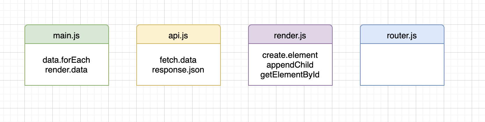

<!-- Add a link to your live demo in Github Pages 🌐-->
Link naar live demo: https://lottetekulve.github.io/web-app-from-scratch-2021/

<!-- ☝️ replace this description with a description of your own work -->

## Table of content:
- About the app
- Get de data van de api
- Gebruik van de data
- Filter, map & reduce
- Feedback aan de gebruiker
- Proces per week

# Rijksmuseum webapp. Data gekregen uit API:
API link: https://www.rijksmuseum.nl/api/nl/collection/?key=7TAeATmh
In deze API is voor alle art objecten uit het rijksmuseum informatie te vinden. Denk aan de kunstenaar, uit welk jaar, waar het gemaakt is en natuurlijk de titel met een afbeelding. Daarnaast worden de artikel nummers vernoemd en links naar de detailpagina van het kunstwerk op de website van het rijksmuseum. 
Er komt overzichtspagina waarbij je alle art objects kan zien, samen met hun titel en de kunstenaar. Op de overzichtspagina komen filters om makkelijk een art object te kunnen terug vinden. Daarnaast krijgt elk art object een eigen detail page waar nog wat meer informatie te vinden zal zijn over de kunstwerken.

# Get de data van de api:
- `export default function getData(url) { `
  `return fetch(url)`
    `.then((response) => response.json())`
   ` .catch((err) => console.log("Error: " + err));`
`}`

# Gebruik van de data
- `export function render(data) {`
  `clearElement(section2)`

- `link.href = #artobject/${data.objectNumber};`
  `title.textContent = data.title;`

- `link.appendChild(container);`
  `container.appendChild(picture);`

# Filter, map & reduce
Filter:
- `function buttonFunction2 () {`
      `clearElement(section1)`
     ` getData(url).then((data) => `
     ` { let objectsOfArt = data.artObjects`
       ` let objectsOfArt2 = (objectsOfArt).filter(function(filteredData)`
       ` {`
         ` return filteredData.productionPlaces != '' } );`
     ` {`
       ` objectsOfArt2.forEach((artObject) => { render(artObject) } );`
   ` }}); }}`

# Feedback aan de gebruiker

# Proces per week
Week 3
Deze week hebben wij weer enkele opdrachten mee gekregen om aan te werken:

1. Manipulate, filter and sort data 
Ik ben bezig geweest met het filteren van de data uit de API en om filters te maken voor de production places.

2. Give feedback to user
Het duurt vrij lang voordat alle data geladen is wanneer je de data filtered. Hiervoor ben ik een loading state gaan maken.

3. Code splitsen in modules
Dit had ik deels vorige week al gedaan. Deze week zet ik de laatste dingen in modules. Zoals de filter function en de loading state.

Done:
- [x]Filter optie 
- [x] Modules gemaakt en werkend gekregen.

Do:
- [x] Feedback geven aan gebruiker
- [x] Map en Reduce.

Week 2
Deze week hebben wij weer enkele opdrachten mee gekregen om aan te werken:

 1. create actor diagram:
 
 In de actor diagram zie je welke modules ik heb en welke functions hierin gebruikt worden.

 2. Create interaction diagram
 In deze diagram zie je hoe de interactie gaat tussen de verschillende modules en functions.

 3. Handle routes to the detailpages
Ik ben bezig geweest met het maken van een detail page per art object. Dit heb ik gedaan doormiddel van routie. 
Link naar routie: http://projects.jga.me/routie/
Op de detailpage laat ik meer informatie zien van de art objects. Namelijk de artikel nummers en plaats waar het voor het eerst gemaakt is.
 
Done:
- [x] Actor diagram deels gemaakt.
- [x] Begin gemaakt van de detailpages.
- [x] Routie toegevoegd en laten werken.
- [x]Gewerkt aan overzichtpagina.

Do:
- [x]Interaction diagram
- [x]Actor diagram afmaken

Week 1

Dit is de eerste week van het vak Wafs, deze week heb ik voor het eerst data uit een API gehaald door middel van JS. Deze data ga ik gebruiken om een webapp te maken voor het rijksmuseum. Een klein deel van de data staat nu al in de HTML. 

Content:

Ik gebruik nu alleen nog de titel van het kunstwerk en de link naar het kunstwerk op de website van t rijksmuseum. Ik ga aankomende week kijken naar wat voor content ik wil gaan gebruiken.

Done:
- [x]Data uit API gehaald
- [x]Begin gemaakt van de HTML, CSS en JS
- [x] Eerste elementen in de html geplaatst

Do:
- [x] Bedenken welke data ik nodig heb
- [x] Bedenken wat voor webapp ik wil gaan maken, wat gaat functie zijn etc.

